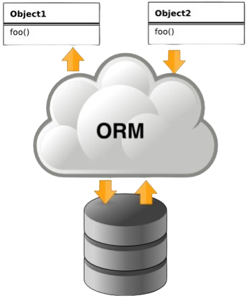

## DEJA (Dao Easy for JAVA)

### Libreria DAO extremadamente simple para JAVA

1. [Qué es DEJA](#queEs)
2. [Qué no pretende DEJA](#queNoEs)
3. [Funcionamiento básico](#funcionamiento)
4. [NOTAS FINALES](#final)

### ¿Qué es DEJA?

DEJA o DAO Easy For Java, es una biblioteca JAVA que simplifica el uso de JDBC. Técnicamente usa el patrón DAO para
mapear
las tablas de una base de datos sobre una entidad o clase JAVA que represente a dicha tabla, y mediante el uso de la
herencia
y la generalización sobre una clase de soporte DAO, permite disponer de las operaciones básicas de Actualización,
Inserción y Borrado de un ejemplar de una entidad asi como otras para el buscado y filtrado de datos que he considerado
de utilidad.

Esto es similar a lo que hacen entornos como JPA/HIBERNATE. DEJA lo hace de un modo más primitivo pero eficiente y
supone
un ejemplo práctico de lo útil que es la REFLEXIÓN en estos contextos.

La reflexión es la capacidad de un lenguaje que permite desde dentro de un programa en ejecución, preguntarse sobre su
contenido: Clases, Métodos, Propiedades etc. y poder ejecutar dinámicamente. Este tipo de capacidades permite la
existencia de frameworks como SPRING que permite el modelo de inyección de dependencias de forma eficaz y de entornos de
mapeo objeto-relacional en el caso de las tablas de la base de datos (ORM) como JPA o HIBERNATE.

DEJA pretende ser el gérmen de una herramienta de mapeo objeto-relacional (ORM) extremadamente sencilla.
Queda libre por parte del público para usarla/mejorarla/ampliarla.

### ¿Qué no es DEJA?

Este proyecto no pretende ser una libreria DAO perfecta ni un ORM completo, ya que no soporta transacciones ni
relaciones como pueda soportarse en otros entornos ORM completos como JPA o HIBERNATE.
Es un proyecto personal de investigación sobre el uso de la REFLECTION en JAVA con el que he podido aprender el tremendo
poder de dicha herramienta y comprender en cierto modo como están hechos interiormente entornos como SPRING, JPA o
HIBERNATE.

En realidad la versión 1.00 que presento aquí en GITHUB, es una simplificación y resumen de una versión de DEJA
primigénea, algo más compleja y "torpe" que presenté aquí: [Página web del proyecto DEJA primigéneo][DEJA_INICIAL],
junto con un par de proyectos adicionales basados también en reflexión y que permitian MAPEAR una entidad DEJA sobre un
formulario de JavaFX y un constructor Gráfico de Consultas para DEJA. Les invito a echarle un ojo por curiosidad si lo
desean.

### Funcionamiento básico de DEJA

DEJA funciona de la siguiente manera:

1. Creamos una clase que extienda de CONNECTOR con los parámetros necesarios para la conexión a nuestro entorno de
   datos.
   y sobreescribimos el método getParameters poniendo el driver JDBC (que debe estar precargado en el IDE para su
   compilación),
   la URL de conexión y el par USUARIO/CONTRASEÑA para conectarse a la base de datos.

 ~~~
    public class ConnectorToTest extends Connector {
        @Override
        public ConnectorParam getParameters() {
            return new ConnectorParam
                (
                        "com.mysql.cj.jdbc.Driver",
                        "jdbc:mysql://www.kronexilane.org/test",
                        "TestUser",
                        "TestUser"
                );
       }
   }
~~~

2. Registramos la clase "Conectora" en el archivo DEJADataSources.xml que tiene el siguiente
   formato y debe estar en la raíz del proyecto.

~~~
    <?xml version="1.0" encoding="UTF-8"?>
    <sqlengines default="kronexilane_test">
        <engine description="Data Source en www.kronexilane.org (TEST)" class="Test.db.datasources.ConnectorToTest" key="kronexilane_test"/>
    </sqlengines>
~~~

Las claves de cada entrada son:

*description:* Descripción del origen de datos,
*class:* Clase conectora,
*key:* Clave para referirse a ella.

con *default* indicamos la clase conectora por defecto a la que se conectarán todas las clases DAO si
no se específica otra cosa.

3. Clase Entidad o (POJO)
   Tenemos que crear la clase que "MAPEA" la tabla de la base de datos para la cual
   queremos crear su clase DAO, teniendo en cuenta lo siguiente:
    + Todos los atributos de la tabla deberán tener el mismo nombre que los campos de la tabla
    + Se utilizará la anotación **DEJAEntity(name="Tabla")** a nivel de clase para indicar el nombre de la tabla
    + Se utilizará la anotación **DEJAPrimary(autonumeric=true|false)** a nivel de atributo para indicar el atributo que
      es clave primaria.
    + Si implementamos la interface Cloneable, y su método Clone() podremos usar el método Update de DAO que generará
      una sentencia UPDATE en el método DAO UPDATE cálculando
      las diferencias entre la original y el cambio generando una sentencia UPDATE con sólo los cambios.
    + Los métodos get y set deben seguir el estándar de JAVA ([set|get]NombreCampo) para que la clase DAO funcione.

 ~~~
    @DejaEntity(name="NombreTabla")
    public class MiEntidad{
        @DejaPrimaryKey(autonumeric=true|false) 
        private Type1 Campo1;
        private Type2 Campo2;
        ....
   }
~~~ 

[DEJA_INICIAL]:https://sites.google.com/view/kronexilane/inicio

4. Clase DAO
   Simplemente creando

 ~~~
    public class MiDAO extends DAO<MiEntidad,TipoClavePrimaria> {
    
    }
~~~ 

~~~
   // En la instancia 'dao' ya disponemos de operaciones CRUD
   MiDAO dao=new MiDAO();    
   MiEntidad ejemplar;
   
   /* 
      Ejemplar devolverá una instancia
      de mi entidad con la fila de la tabla
      con la clave primaria 183
      Null si no se encontró.
   */
   ejemplar=dao.LoadByPK(183);
   
   
~~~

Si sobreescribimos el método Connector, podremos "llamar" a otro Connector registrado
en DEJADataSources.xml y que se instanciará mediante la clave 'key' especificada en su entrada
del archivo xml através del Singletron ConnectorFactory.

 ~~~
    public class MiDAO extends DAO<MiEntidad,TipoClavePrimaria> {
        @Override
        public Connector Connector() {
            return ConnectorFactory.getInstance().getDBEngine("conector_key_registrado");
        }
    }
~~~ 

### Notas Finales

## Drivers JDBC

Los drivers JDBC deben descargarse en el proyecto para poder crear los CONNECTOR o DATASOURCES
necesarios. Integrarlos manualmente o con algún sistema de repositorio tipo MAVEN.

## Librerias Compiladas

En la carpeta **out/release** se encuentra una versión ya compilada de la libreria DEJA llamada:
*kronexilane-deja-1.0.jar*
y una versión de la Libreria JAVADOC **kronexilane-deja-javadoc.jar** con su ayuda para los entornos que lo admitan

## Proyecto de Test

El proyecto tal cual se descarga dispone de un paquete de Test con unas clases sencillas
que conectan a una base de datos remota y limitada de pruebas de mi propio servidor web.
**Recordamos la necesidad de descargar el driver JDBC de MySQL para poder conectarse a la
base de datos de test.**
